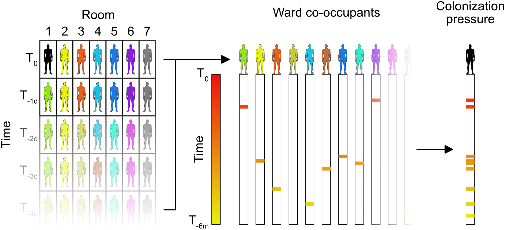
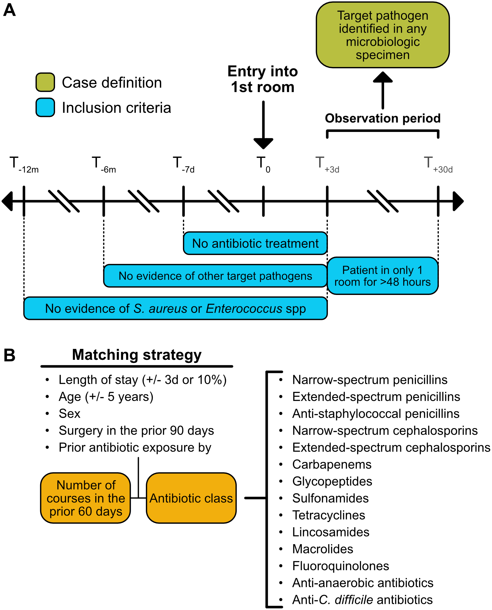

# The association of hospital unit colonization pressure on nosocomial acquisition of drug-susceptible and drug-resistant pathogens

## Background

Hospitalized patients are at risk for developing hospital-acquired infections (HAI). A primary mechanism for HAI begins when a patient who is colonized with a potential pathogen is admitted to the hospital. That individual becomes a reservoir from which the hands and clothing of healthcare workers, hospital equipment and room surfaces are contaminated. Contact with these contaminated surfaces results in transmission to and colonization of a new vulnerable host. Colonization is a strong predictor of future clinical infection(Martin 2016,Eiff 2001,Worley 2020). The cycle repeats when the second patient becomes a new reservoir for onward nosocomial transmission. 

Active surveillance for colonization of asymptomatic individuals is a key part of infection control, but requires significant investment in infrastructure and human resources. For this reason it is typically limited to intensive care units  (ICUs) and other high-risk units, and to a few drug-resistant or high-virulence organisms, such as methicillin-resistant Staphylococcus aureus (MRSA) and vancomycin-resistant Enterococcus species (VRE). Colonization pressure (CP), defined as the prevalence of an organism among patients in the ward into which a patient enters, has the potential to augment active surveillance efforts. This is due to the fact that estimating CP does not require new data collection, instead relying on information already present in the electronic health record (EHR). Furthermore, colonization pressure can easily be calculated for any number of organisms in any area of the hospital using routine EHR data, whereas expanding active surveillance can be disruptive to care and costly. 

Prior studies have shown a direct association between CP and HAI(Bonten 1998,Ajao 2011,Arvaniti 2012), suggesting its potential role as a risk assessment tool. However, analyses were limited to known drug-resistant nosocomial pathogens and to ICU settings. Whether the same relationship applies to drug-susceptible organisms, which are responsible for a majority of infections in hospitals in the United States, and to non-ICU settings, remains unknown. Thus, the objectives of this study are twofold. Our first goal is to build a prototype of an infection control informatics tool that can construct ward-level CP across a variety of drug-susceptible and drug-resistant organisms using EHR data. Second, we test the hypothesis that CP is associated with HAI from those organisms by applying our prototype to a cohort of HAI cases matched to controls by demographics, surgery, and fine-grained antibiotic exposures. 

---

## File Description

### Scripts
1. `HO_infxn_functions.R`

    **Description:** Functions for pre-processing and cohort building for colonization pressure / hospital-onset infection analysis
    
    **Input Files**
    - None

    **Output Files**
    - None

2. `HO_infxn_C_Diff_micro_query.R`

   **Description:** Script to pull any patients who had a C.difficile test performed

    **Input Files**
    - `edw_cdiff.csv`
    - `EDW_Cdiff_results_map.csv`

    **Output Files**
    - `Cdiff.csv`

3. `HO_infxn_micro_prep.R`

    **Description:** Script to process micro data for HO-infection study
    
    **Input Files**
    - `micro_raw.csv`
    - `Cdiff.csv`

    **Output Files**
    - `micro_ground_truth.csv`

4. `HO_infxn_input_data_preprocessing.R`

    **Description:** Input data pre-processing for colonization pressure / hospital-onset infection analysis

    **Dependent Scripts**
    - `HO_infxn_functions.R`

    **Input Files**
    - `micro_ground_truth.csv`
    - `ADT.csv`
    - `abx.csv`
    - `abx_map.csv`
    - `IP_ED_encounters.csv`
    - `encounters.csv`

    **Output Files**
    - `ADT_clean.csv`
    - `micro_dedup.csv`
    - `abx_prelim_clean.csv`
    - `abx_courses.csv`
    - `enc_clean.csv`
    - `admt_clean.csv`

5. `HO_infxn_build_unmatched_cohorts.R`

    **Description:** Build unmatched cohorts for colonization pressure / hospital-onset infection analysis

    **Dependent Scripts**
    - `HO_infxn_functions.R`

    **Input Files**
    - `ADT_clean.csv`
    - `micro_dedup.csv`
    - `abx_courses.csv`
    - `enc_clean.csv`
    - `micro_ground_truth.csv`
    - `abx_prelim_clean.csv`

    **Output Files**
    - `adt_micro_raw.csv`
    - `path_cat_table.csv`
    - `unmatched_case_controls_no_features.csv`

6. `HO_infxn_add_features.R`

    **Description:** Add features to cohorts in colonization pressure / hospital-onset infection analysis

    **Dependent Scripts**
    - `HO_infxn_functions.R`

    **Input Files**
    - `unmatched_case_controls_no_features.csv`
    - `adt_micro_raw.csv`
    - `demographics.csv`
    - `abx_courses.csv`
    - `elixhauser.csv`
    - `procedures.csv`
    - `admt_clean.csv`
    - `department_mapping.csv`
    - `enc_clean.csv`
    - `ADT.csv`
    - `micro_ground_truth.csv`
    - `path_cat_table.csv`

    **Output Files**
    - `dems_clean.csv`
    - `abx_clean.csv`
    - `elix_clean.csv`
    - `cpt_clean.csv`
    - `admt_clean.csv`
    - `prior_occupant.csv`
    - `col_pressure.csv`
    - `path_cat_table_matching.csv`
    - `unmatched_case_controls_features.csv`

7. `HO_infxn_build_matched_cohorts.R`

    **Description:** Matches cases to controls for colonization pressure / hospital-onset infection analysis

    **Dependent Scripts**
    - `HO_infxn_functions.R`

    **Input Files**
    - `path_cat_table_matching.csv`
    - `unmatched_case_controls_features.csv`

    **Output Files**
    - `final_cohort.csv`
    - `final_dataset_for_models.csv`

8. `HO_infxn_models.R`

    **Description:** Models for colonization pressure / hospital-onset infection analysis

    **Input Files**
    - `final_dataset_for_models.csv`

    **Output Files**
    - `clogit_coefficients.csv`
    - `xgboost_feature_importance.csv`

9. `HO_infxn_tables_figures.R`

    **Description:** Data visualizations for colonization pressure / hospital-onset infection analysis

    **Input Files**
    - `final_dataset_for_models.csv`
    - `clogit_coefficients.csv`

    **Output Files**
    - None

### Data Files
1. `final_dataset_for_models.csv`

    **Description:** The final data ready for running Conditional Logistic Regression (CLR) and XGBoost.

    **Key Columns:**
    - `run` : The name of organism infection for the sample.
    - `group` : Whether the sample is classified as control or case in the matched study.
    - `[abx]_0_60` : Prior number of *abx* courses used in the prior 60 days.
    - `prior_[organism]` : Binary indication of whether the sample has been exposed to *organism* in the prior 365 days.
    - `[organism]_cp` : Calculated *organism* colonization pressure for the sample.
    - `elix_index_mortality` : Calculated elixhauser index for the sample.

---
## De-Identification
To ensure compliance with HIPAA guidelines and protect patient privacy:
- Patient IDs are anonymized, and all identifiable information is removed.
- Patients with Age > 90 are removed from analysis to enture patient privacy.
- Hospital Admission and Discharge dates are anonymized as random dates and time while maintaining relative time for the same patient.

---
## Sharing/Access Information
- This dataset is publicly available on Physionet[] for research purposes.
- Users are encouraged to contact the code base/dataset creators for support or further clarification of needed.

---
## Code/Software
- **R (v 4.4.0)** is used in constructing the dataset and running the models. 

---
## Usage Notes
### Ethical Considerations
This study was approved by the Institutional Review Board (IRB) of Massachusetts General Brigham with a waived requirement for informed consent.

---
## Citation
When using the code and dataset, please cite: Sagers L, Wei Z, McKenna C, Chan C, Agan AA, Pak R, et al. Hospital unit colonization pressure and nosocomial acquisition of drug susceptible and drug resistant pathogens. 

## Contact
For quesetions, clarifications, or further support, please contact:

**Sanjat Kanjilal, MD, MPH**
Harvard Medical School and Harvard Pilgrim Healthcare Institute
SKanjilal@bwh.harvard.edu
